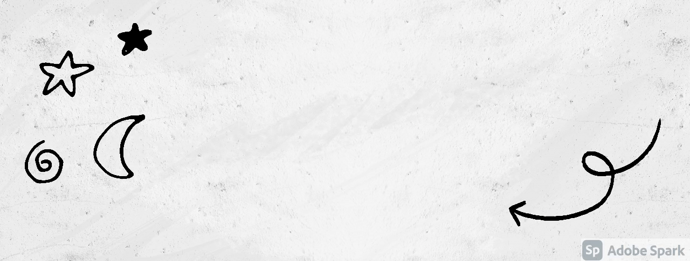

<h1 align='center'> Hey there! :wave:</h1>

## Introduction
 

This was translated into code, based on a Figma design, using Bootstrap. It was my first time using Bootstrap, and I was happy with the result. Will definitely explore more with Bootstrap!

 

## Built with

 

## Demo 

For inquiries, contact me via<a href = "mailto:janimargaret09@gmail.com"> Gmail</a> or over on <a href="https://www.linkedin.com/in/janiel-banasihan/">LinkedIn</a>.

 

<h1 align='center'><i>Stay awesome!</i></h1>